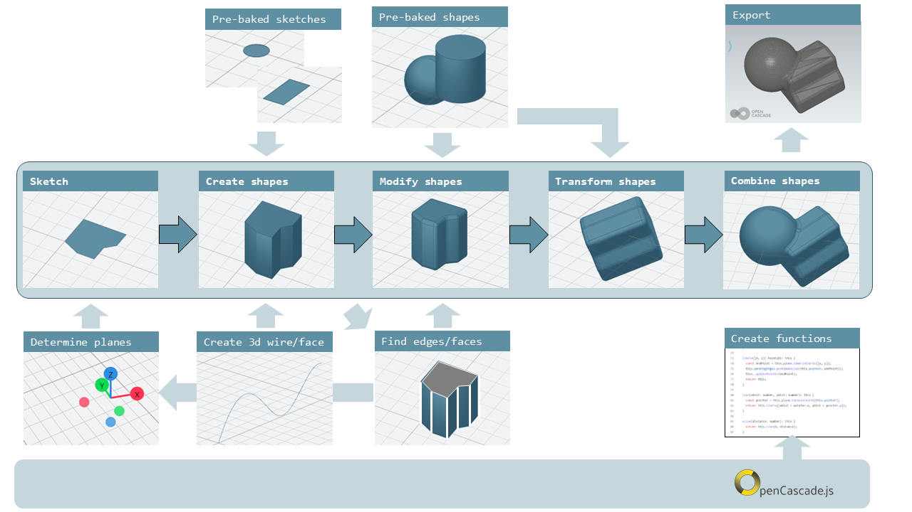
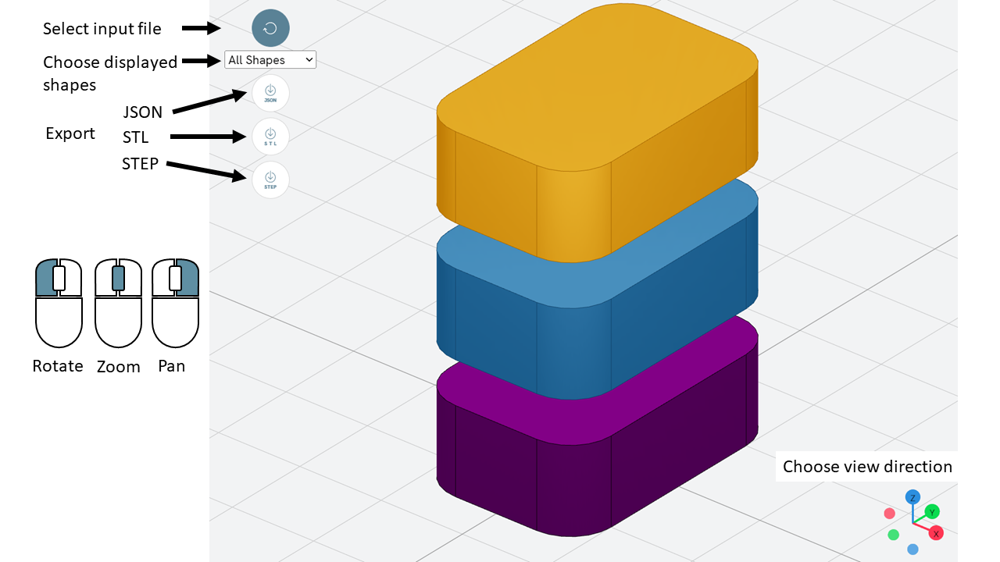
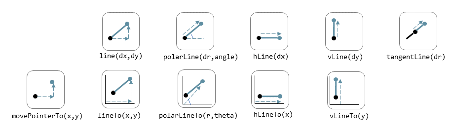
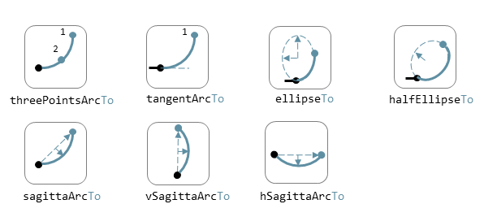
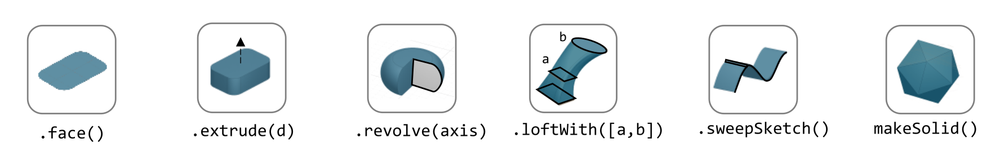
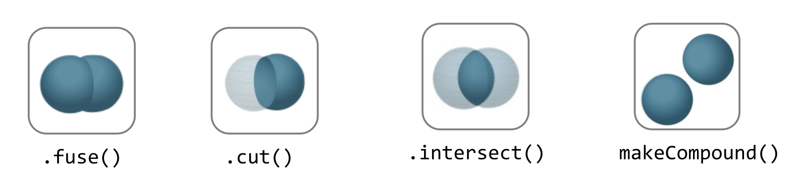

# Process

The process to draw a shape in Replicad looks like this:



Replicad is a library that is based on another library library called
opencascade.js (see <https://github.com/donalffons/opencascade.js>). The
functions in this library are explained at <https://ocjs.org/>. There
are Replicad functions that are close to the opencascade kernel but also
more user friendly functions that shield the user from the complexity of
this library. The normal flow to define a shape is to start with a
2-dimensional sketch of the shape, then use a function like extrude or
revolve to define a 3 dimensional shape. This 3 dimensional shape can
then be modified, for example by rounding edges. In its simplest form
this modification is applied to all edges at once. A more advanced
approach is to select individual edges or faces to apply the
modification. When the shape is complete it can be transformed, for
example by translating, rotating et cetera. Finally a shape can be
combined with another shape. Combinations can mean fusing the shapes
together, subtracting one shape from the other or finding the
intersection between two shapes.

A beginner can start with the pre-baked shapes to shorten the path to
determine a shape. There are 2 dimensional pre-baked shapes like
rectangles and circles, and 3 dimensional shapes like spheres or
cylinders.

# Visualiser

A model in Replicad is built using a javascript input file (see next
Section). This file defines a "main" function that should return the
shapes that you want to visualise or export. The easiest way to check
that the part is generated correctly and to export the result is to use
the **Visualiser** that is offered on the Replicad site
<https://studio.replicad.xyz/visualiser>.



The Visualiser supports exporting to JSON, STL and STEP format.

# File template

The template to create and display a 3D part in Replicad looks like
this.

```javascript
const defaultParams = {                // setting the value of the parameters
  height:       100,
  baseWidth:     20,
  ...}

// next lines allow intellisense help in VS Code
/** @typedef { typeof import("replicad") } replicadLib */
/** @type {function(replicadLib, typeof defaultParams): any} */

function main(
 { Sketcher, sketchRectangle, ... },   // functions used within the main program
 { height, basewidth, ....        } )  // parameters to adjust the model
{
    // add code to describe the shape
return  shape   |
return  {shape: [shape], highlight: [foundFeature]}
}
```

Alternatively you can use the arrow notation for the javascript function

```javascript
const defaultParams = {                // setting the value of the parameters
  height:       100,
  baseWidth:     20,
  ...}

const main = (
  { Sketcher, sketchRectangle, ... },   // functions used within the main program
  { height, basewidth, ....        }    // parameters to adjust the model
) => {
    // add code to describe the shape
return  shape   |
return  {shape: [shape], highlight: [foundFeature]}
}
```

If you want to display multiple shapes, the returned variable should be
an array of all shapes. In this array it is possible to define

- the variable name of the shape,

- the name of the shape as a "string",

- the color of the shape in the Visualiser, using the X11 "color
  name", see
  <https://en.wikipedia.org/wiki/X11_color_names#Color_name_chart>

- the opacity, where opacity 1 is the default (visible) and 0 is fully
  transparant.

An example of an array is:

```javascript
let shapeArray = [
  { shape: plunge, name: "plunge", color: "steelblue", opacity: 0.5 },
  { shape: body, color: "orange", opacity: 0.5 },
  { shape: filler, color: "red" },
];
```

# Sketch

To start a sketch, use the `new Sketcher` command. Note the keyword
`new` that is required to create a new object of the type `Sketcher`.

```javascript
let sketch = new Sketcher("XZ",-5)
".sketchCommands"        (see below)
.close()                    // ends the sketch with line to starting point
.done()                     // ends the sketch without closing
.closeWithMirror()          // closes the sketch with mirror on axis from start to end
```

Use the following ".methods" to describe the sketch:

## Lines



Lines can be sketched using the line functions. Be aware that points are
generally defined as a tuple or array, i.e. enclosed in square brackets.
This array either contains the absolute distance in the x and y
direction from the origin, or the distance and angle in case of polar
coordinates. Relative distances to the x- and y-axis are defined as two
separate values dx and dy.

|                                |                                                                                                                        |
| ------------------------------ | ---------------------------------------------------------------------------------------------------------------------- |
| `.movePointerTo([x,y])`        | move pointer without drawing, can only be used at start                                                                |
| `.lineTo([x,y])`               | line to absolute coordinates                                                                                           |
| `.line(dx,dy)`                 | line to relative coordinates                                                                                           |
| `.vLineTo(y)`                  | vertical line to absolute y                                                                                            |
| `.vLine(dy)`                   | vertical line to relative y                                                                                            |
| `.hLineTo(x)`                  | horizontal line to absolute x                                                                                          |
| `.hLine(dx)`                   | horizontal line to relative x                                                                                          |
| `.polarLineTo([radius,theta])` | line to absolute polar coordinates. Note that the absolute polar coordinates are defined as an vector \[radius,theta\] |
| `.polarLine(distance,angle)`   | line to relative polar coordinates                                                                                     |
| `.tangentLine(distance)`       | tangent extension over distance                                                                                        |

## Arcs and ellipses



The following commands are available to create circular and elliptical
arcs in your sketch. Just as with lines be aware that points are
generally defined as a tuple or array, i.e. enclosed in square brackets.
Relative distances to the x- and y-axis are defined as two separate
values dx and dy. The elliptic curves can be defined in more detail with
three extra parameters. If the values are omitted the default values are
used.

|                                              |                                                                          |
| -------------------------------------------- | ------------------------------------------------------------------------ |
| `.threePointsArcTo(point_end,point_mid)`     | arc from current to end via mid, absolute coordinates                    |
| `.threePointsArc(dx,dy,dx_via,dy_via)`       | arc from current to end via mid, relative coordinates                    |
| `.sagittaArcTo(point_end,sagitta)`           | arc from current to end with sag , absolute coordinates                  |
| `.sagittaArc(dx,dy,sagitta)`                 | arc from current to end with sag, relative coordinates                   |
| `.vSagittaArc(dy,sagitta)`                   | vertical line to endpoint with sag, relative y                           |
| `.hSagittaArc(dx,sagitta)`                   | horizontal line to endpoint with sag, relative x                         |
| `.tangentArcTo([x,y])`                       | arc tangent to current line to end, absolute coordinates                 |
| `.tangentArc(dx,dy)`                         | arc tangent to current line to end, relative coordinates                 |
| `.ellipseTo([x,y],r_hor,r_vert)`             | ellipse from current to end, absolute coordinates, radii to hor and vert |
| `.ellipse(dx,dy,r_hor,r_vert)`               | ellipse from current to end, relative coordinates, radii to hor and vert |
| `.ellipse(dx,dy,r_h,r_v,a_start,a_end,true)` | extra parameters ellipse: startangle, endangle, counterclockwise?        |
| `.halfEllipseTo([x,y],r_min)`                | half ellipse with r_min as sag, absolute coordinates                     |
| `.halfEllipse(dx,dy,r_min)`                  | half ellipse with r_min as sag, relative coordinates                     |

## Free form curves


|                                                      |                                                      |
| ---------------------------------------------------- | ---------------------------------------------------- |
| `.bezierCurveTo([x,y],points[])`                     | Bezier curve to end along points\[\]                 |
| `.quadraticBezierCurveTo([x,y],[x_ctrl,y_ctrl])`     | Quadratic bezier curve to end with control point     |
| `.cubicBezierCurveTo([x,y],p_ctrl_start,p_ctrl_end)` | Cubic bezier curve with begin and end control points |
| `.smoothSplineTo([x,y],splineconfig)`                | smooth spline to end, absolute coordinates           |
| `.smoothSpline(dx,dy,splineconfig)`                  | smooth spline to end, absolute coordinates           |
| ``                                                   | ``                                                   |

# Pre-baked sketches


|                                     |                                                                                                                                                                      |
| ----------------------------------- | -------------------------------------------------------------------------------------------------------------------------------------------------------------------- |
| `sketchRectangle(length,width)`     | create a sketch of a rectangle with length and width                                                                                                                 |
| ``                                  | create a sketch of a rounded rectangle                                                                                                                               |
| ``                                  | create a sketch of a circle                                                                                                                                          |
| ``                                  | create a sketch of an ellipse                                                                                                                                        |
| ``                                  | create a sketch of a regular polygon, where the sides of the polygon are lines or arcs with a sag from the straight line. The radius is defined without the sagitta. |
| ``                                  | create a sketch of a text. The textConfig defines the fontFamily, fontSize, startX,startY                                                                            |
| `sketchFaceOffset(shape,thickness)` | create a sketch by defining an offset from an existing face in the scene                                                                                             |
| ``                                  | create a sketch of a parametric function                                                                                                                             |

# Create a drawing

A drawing can be understood as an adapted version of a sketch. A sketch
starts with identifying the sketching plane first and then defining a
wire. As the plane is defined up front, the sketch is in fact a 3D shape
from its origin. In contrast a drawing is considered a pure 2D shape
that can be placed on a plane after its creation. Compared to a sketch a
drawing has the following advantages:

- drawings can be translated, rotated (in 2D space) and scaled;

- drawings can be used in 2D boolean operations;

- drawings can be exported directly in 2D formats;

- drawings can be placed on other shapes, not only planes

The drawing can be defined with the `draw()` function. As this function
already includes the creation of a new object the `new` keyword is not
needed.

```javascript
const shape1 = draw()
  .lineTo([20, 0])
  .line(0, 5)
  .hLine(10)
  .vLine(5)
  .polarLineTo([22, 45])
  .polarLine(10, 150)
  .halfEllipse(-10, -15, 5)
  .smoothSpline(2, -5)
  .close();
```

## Methods for drawings

As a drawing is a type of sketch (that is not yet assigned to a plane)
the methods described earlier to create a sketch such as

- [Lines](#lines)

- [Arcs and ellipses](#arcs-and-ellipses)

- [Free form curves](#free-form-curves)

can also be used to define a drawing.

|                                         |                                                                                                                                                               |
| --------------------------------------- | ------------------------------------------------------------------------------------------------------------------------------------------------------------- |
| `.clone()`                              |                                                                                                                                                               |
| `.mirror([center/dir],[origin],mode? )` | mode? "center" or "plane"                                                                                                                                     |
| `.translate(xDist,yDist)`               |                                                                                                                                                               |
| `.rotate(angle,[center])`               |                                                                                                                                                               |
| `.stretch(ratio,direction,origin)`      |                                                                                                                                                               |
| `.cut(cuttingDrawing)`                  |                                                                                                                                                               |
| `.fuse(other)`                          |                                                                                                                                                               |
| `.sketchOnFace(face,scaleMode)`         | The scale mode is "original" for global coordinates, "bounds" for following UV of the receiving face or "native" for the default UV parameters of opencascade |
| `.sketchOnPlane`                        |                                                                                                                                                               |
| `.toSVG(margin)`                        | format the drawing as an SVG image                                                                                                                            |
| `.toSVGPaths()`                         | format the drawing as a list of SVG paths                                                                                                                     |
| `.toSVGViewBox`                         | return the SVG viewbox that corresponds to this drawing                                                                                                       |

## Pre-baked drawings

Similarly as for the sketches, some pre-baked drawings are available to
speed-up the creation of standard shapes. As the draw() object also
allows boolean operations the creation of more complex shapes can be
achieved by combining a number of standard shapes.

|                                                                                     |                                                                                                                                                                                                                             |
| ----------------------------------------------------------------------------------- | --------------------------------------------------------------------------------------------------------------------------------------------------------------------------------------------------------------------------- |
| `drawRoundedRectangle(length, width, radius)`                                       | Draw a rounded rectangle centered at \[0,0\]                                                                                                                                                                                |
| `drawSingleCircle(radius)`                                                          | Creates the `Drawing` of a circle as one single curve. The circle is centered on \[0, 0\]                                                                                                                                   |
| `drawCircle(radius)`                                                                |                                                                                                                                                                                                                             |
| `drawSingleEllipse(majRadius,minRadius)`                                            | Creates the `Drawing` of an ellipse as one single curve. The ellipse is centered on \[0, 0\], with axes aligned with the coordinates.                                                                                       |
| `drawPolysides(radius, sidesCount,sagitta = 0)`                                     | Creates the `Drawing` of an polygon in a defined plane. The sides of the polygon can be arcs of circle with a defined sagitta. The radius defines the out radius of the polygon without sagitta.                            |
| `drawText("text",{ startX = 0, startY = 0, fontSize = 16, fontFamily = "default" }` | Draw a 2D text. The options can be used to adjust location, fontsize and font.                                                                                                                                              |
| ``                                                                                  | Draw a parametric function with variable t. With the option it is possible to adjust the number of intermediate points that are used { pointsCount = 400, start = 0, stop = 1 } and the type of approximation of the curve. |
| ``                                                                                  | Draw a bSpline through the array of points                                                                                                                                                                                  |

# Create 3D face/wire

## Create wires in 3D

In comparison to sketches which create wires or faces in 2D

|                                                                             |     |
| --------------------------------------------------------------------------- | --- |
| `makeLine([point],[point])`                                                 |     |
| `makeCircle(radius,[center],[normal])`                                      |     |
| `makeEllipse(major,minor,[center],[normal])`                                |     |
| `makeHelix(pitch,height,radius,[center],[dir],lefthand?)`                   |     |
| `makeThreePointArc([point1],[point2],[point3])`                             |     |
| `makeEllipseArc(major,minor,anglestart,angleEnd,[center],[normal],[xDir?])` |     |
| ``                                                                          |     |
| `makeBezierCurve([points[]])`                                               |     |
| `makeTangentArc([startPoint],[tangentPoint],[endPoint])`                    |     |
| `assembleWire([Edges])`                                                     |     |

## Create faces in 3D

|                                     |     |
| ----------------------------------- | --- |
| `makeFace(wire)`                    |     |
| `makeNewFaceWithinFace(face,wire)`  |     |
| `makeNonPlanarFace(wire)`           |     |
| `makePolygon(points[])`             |     |
| `makeOffset(face,offset,tolerance)` |     |
| `makePlaneFromFace()`               |     |

# Create shapes



The generic command to create a 3D shape from a 2D sketch is:

```javascript
let shape = sketch.thicknessMethod;
```

The following `.thicknessMethods` are available to add thickness or
volume to a 2D sketch:

|                                                                   |                                                                                                                                                                                                                 |
| ----------------------------------------------------------------- | --------------------------------------------------------------------------------------------------------------------------------------------------------------------------------------------------------------- |
| `.face()`                                                         | Create a face from the sketch. Note that this is not needed in most needed as a closed sketch already is translated into a face that can be used directly for extrusion, revolving or sweeping.                 |
| `.extrude(distance,extrusionConfig?)`                             | extrude a face over a distance normal to the face. In the extrusion configuration it is possible to define a different extrusion direction, a certain profile for the extrusion and a twist over the extrusion. |
| ``                                                                | extrusionConfig                                                                                                                                                                                                 |
| ``                                                                | extrusionProfile                                                                                                                                                                                                |
| `.loftWith([otherSketches],loftConfig,returnShell?)`              | build a solid through lofting between different wires                                                                                                                                                           |
| `{ endPoint:[point], ruled: boolean, startPoint:[point]}`         | loftconfig                                                                                                                                                                                                      |
| `.revolve(revolutionAxis:[point],config?)`                        | revolve a face around the z-axis to create a solid shape. Adapt the axis of rotation and the origin in the configuration.                                                                                       |
| `origin:[point]`                                                  | config                                                                                                                                                                                                          |
| `.sweepSketch( (plane, origin) ⇒ sketchFunction(plane,origin) );` | Sweep the sketch defined by the sketchFunction along the sketch used as the object for this method.                                                                                                             |
| `makeSolid(faces[]/shell)`                                        | Create a solid from the volume that is defined by the array of faces or by a surface.                                                                                                                           |

The `sketchFunction` used in the `.sweepSketch()` can be derived from
either a standard sketching function, such as
`sketchRectangle(2, 30, { plane, origin })` or by defining your own
closed sketch using a `Sketcher` object. This object should then refer
to a `(plane, origin)` like this:

```javascript
            function sketchFunction(plane,origin)
            {let section = new Sketcher(plane,origin)
                    (add sketch commands)
                    .close()
            return section}
```

# Pre-baked shapes

|                                                      |                       |
| ---------------------------------------------------- | --------------------- |
| `makeCylinder(radius,height,[location],[direction])` | create a cylinder     |
| `makeBaseBox(xLength,yLength,zLength)`               | create a box          |
| `makeSphere(radius)`                                 | create a sphere       |
| `makeVertex([point])`                                | create a vertex/point |

# Modify shapes

|                                    |                                                                                                                                                                                                                       |
| ---------------------------------- | --------------------------------------------------------------------------------------------------------------------------------------------------------------------------------------------------------------------- |
| `.fillet(radiusConfig,filter?)`    | round an edge of a shape with a fixed radius or a radius that is defined by a function. The filter refers to the selection mechanism defined in the next secion. It has the general shape of (e) ⇒ e.inDirection("X") |
| `.chamfer(radiusConfig,filter?)`   | take of a sharp edge by creating a transitional face, default at 45 degrees to a edge                                                                                                                                 |
| ``                                 | create a thin walled object from a shape, removing the indicated face from the shape to provide access to the hollow inside.                                                                                          |
| `makeOffset(shape,thickness)`      | create a shape that is offset from the original shape by the thickness. A positive number results in an increased size of the shape, a negative value will result in a smaller shape                                  |
| `addHolesInFace(face,holeWires[])` | create a hole in a shape using the wires that are indicated in the parameters to this function.                                                                                                                       |

# Find features

## Faces

```javascript
let foundFaces = new FaceFinder().inPlane("XZ", 35);
```

|                                         |                                                                                                                                                                                   |
| --------------------------------------- | --------------------------------------------------------------------------------------------------------------------------------------------------------------------------------- |
| `.inPlane("XZ",35)`                     |                                                                                                                                                                                   |
| `.ofSurfaceType("CYLINDRE")`            |                                                                                                                                                                                   |
|                                         | surface types : "PLANE" / "CYLINDRE" / "CONE" /"SPHERE"/ "TORUS" / "BEZIER_SURFACE" /"BSPLINE_SURFACE"/"REVOLUTION_SURFACE"/"EXTRUSION_SURFACE"/ "OFFSET_SURFACE"/"OTHER_SURFACE" |
| `.containsPoint([0,-15,80])`            |                                                                                                                                                                                   |
| `.atAngleWith(direction,angle)`         | atAngleWith("Z",20)                                                                                                                                                               |
| `.atDistance(distance,point)`           |                                                                                                                                                                                   |
| `.inBox(corner1,corner2)`               |                                                                                                                                                                                   |
| `.inList(elementList[])`                |                                                                                                                                                                                   |
| `.inPlane(inputPlane,origin)`           | inPlane("XY",30)                                                                                                                                                                  |
| `.parallelTo(plane/face/standardplane)` |                                                                                                                                                                                   |
| ``                                      | returns all the elements that fit the filters                                                                                                                                     |

    new FaceFinder().inPlane("XZ", 30).find(house)

## Edges

|                                                |                                                    |
| ---------------------------------------------- | -------------------------------------------------- |
| `.inDirection([x,y,z]/"X"/"Y"/"Z")`            | find all edges that have the direction             |
| `.ofLength(number)`                            | find all edges with a particular length            |
| `.ofCurveType( todo?)`                         | find all edges of a certain curve type             |
| `.parallelTo(plane / StandardPlane e.g. "XY")` | find all edges parallel to a stanadard plane       |
| `.inPlane(PlaneName / Plane)`                  | find all edges that are exactly in a defined plane |
| `.shouldKeep todo?`                            | tbd                                                |

## Combine filters

|          |                                                           |
| -------- | --------------------------------------------------------- |
| `and`    | both filters should be applied                            |
| `either` | only one of the filters may be applied                    |
| `not`    | select all other edges than those selected by this filter |

```javascript
const houseSides = new FaceFinder().either([
  (f) => f.inPlane("YZ", 50),
  (f) => f.inPlane("YZ", -50),
]);

const frontWindow = new EdgeFinder()
  .ofCurveType("CIRCLE")
  .not((f) => f.inPlane("XZ"));
```

# Transform shapes

The transform functions require a shape or face. A sketch cannot be
transformed, with the exception of creating an offset.

transformedShape = shape."transformCommand"

|                                                      |     |
| ---------------------------------------------------- | --- |
| `"transformCommand = "`                              |     |
| `.translate([dx,dy,dz])`                             |     |
| `.translateX(dx)`                                    |     |
| `.translateY(dy)`                                    |     |
| `.translateZ(dz)`                                    |     |
| `.rotate(angleDeg,axisOrigin[x,y,x],axisEnd[x,y,x])` |     |
| `.scale(number)`                                     |     |
| `.mirror("YZ",[-10,0])`                              |     |
| `.clone()`                                           |     |

# Combine shapes



|                                |                                                                                                                            |
| ------------------------------ | -------------------------------------------------------------------------------------------------------------------------- |
| `.cut(tool,optimisation?)`     |                                                                                                                            |
| `.fuse(otherShape,.. )`        | fuse the othershape with the shape. Other applications call this a "union" between to shapes                               |
| `.intersect(tool)`             | find the volume that is common to the two shapes considered in this method, other applications call this function "common" |
| `compoundShapes(shapeArray[])` | this function is identical to makeCompound                                                                                 |
| `makeCompound(shapeArray[])`   | allows to combine an array of any type of shape into a single entity that can be displayed.                                |
